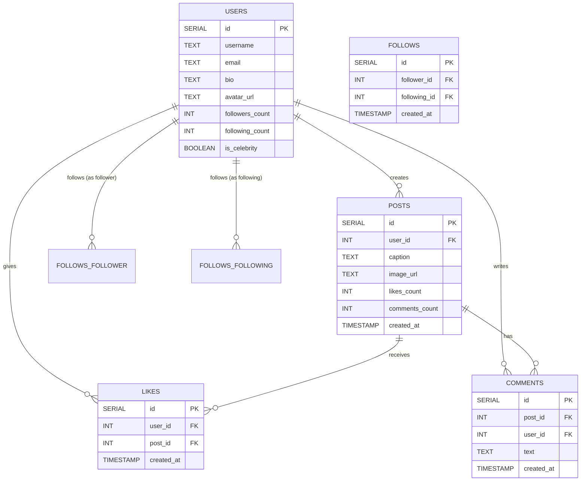

# Entity-Relationship Diagram
## Instagram-Style Feed Database Schema

This ER diagram visualizes the core data model for the Instagram-style feed application with fan-out architecture.



## Relationship Details

### 1. Users → Posts (One-to-Many)
- **Relationship**: A user can create many posts
- **Cardinality**: 1:N
- **Foreign Key**: `posts.user_id` → `users.id`

### 2. Users → Follows (Many-to-Many, Self-Referential)
- **Relationship**: Users can follow other users (self-referential many-to-many)
- **Cardinality**: M:N (through `follows` junction table)
- **Foreign Keys**: 
  - `follows.follower_id` → `users.id` (the user who follows)
  - `follows.following_id` → `users.id` (the user being followed)
- **Constraint**: A user cannot follow themselves (should be enforced in application logic)

### 3. Users → Likes (One-to-Many)
- **Relationship**: A user can like many posts
- **Cardinality**: 1:N
- **Foreign Keys**: `likes.user_id` → `users.id`

### 4. Posts → Likes (One-to-Many)
- **Relationship**: A post can receive many likes
- **Cardinality**: 1:N
- **Foreign Key**: `likes.post_id` → `posts.id`
- **Note**: Should enforce unique constraint: (user_id, post_id) to prevent duplicate likes

### 5. Users → Comments (One-to-Many)
- **Relationship**: A user can write many comments
- **Cardinality**: 1:N
- **Foreign Key**: `comments.user_id` → `users.id`

### 6. Posts → Comments (One-to-Many)
- **Relationship**: A post can have many comments
- **Cardinality**: 1:N
- **Foreign Key**: `comments.post_id` → `posts.id`

## Key Constraints & Indexes

### Recommended Indexes:
```sql
-- For efficient feed queries (fan-out architecture)
CREATE INDEX idx_posts_user_id_created_at ON posts(user_id, created_at DESC);
CREATE INDEX idx_follows_follower_id ON follows(follower_id);
CREATE INDEX idx_follows_following_id ON follows(following_id);
CREATE INDEX idx_likes_post_id ON likes(post_id);
CREATE INDEX idx_likes_user_id_post_id ON likes(user_id, post_id);
CREATE INDEX idx_comments_post_id_created_at ON comments(post_id, created_at DESC);

-- Unique constraint to prevent duplicate likes
CREATE UNIQUE INDEX idx_likes_unique_user_post ON likes(user_id, post_id);

-- Unique constraint to prevent self-follows (application-level check recommended)
-- Prevent duplicate follow relationships
CREATE UNIQUE INDEX idx_follows_unique ON follows(follower_id, following_id);
```

### Data Integrity Rules:
1. **Cascade Deletes**: 
   - When a user is deleted, their posts, likes, and comments should be handled (soft delete recommended)
   - When a post is deleted, its likes and comments should be deleted

2. **Denormalized Counts**:
   - `users.followers_count` and `users.following_count` should be maintained via triggers or application logic
   - `posts.likes_count` and `posts.comments_count` should be updated when likes/comments are added/removed

3. **Celebrity Flag**:
   - `users.is_celebrity` is used for hybrid fan-out strategy (Tier 2)
   - Should be updated when follower count crosses threshold (e.g., 10K followers)

## Visual Representation

```
┌─────────────┐
│    USERS    │
├─────────────┤
│ id (PK)     │◄─────┐
│ username    │      │
│ email       │      │
│ bio         │      │
│ avatar_url  │      │
│ followers_  │      │
│   count     │      │
│ following_  │      │
│   count     │      │
│ is_celebrity│      │
└─────────────┘      │
      │              │
      │              │
      ├──────────────┼──────────────┐
      │              │              │
      │              │              │
┌─────▼─────┐  ┌─────▼─────┐  ┌─────▼─────┐
│   POSTS   │  │  FOLLOWS  │  │   LIKES   │
├───────────┤  ├───────────┤  ├───────────┤
│ id (PK)   │  │ id (PK)   │  │ id (PK)   │
│ user_id   │──┤ follower_ │  │ user_id   │──┐
│ caption   │  │   id (FK) │  │ post_id   │──┤
│ image_url │  │ following_│  │ created_at│  │
│ likes_    │  │   id (FK) │  └───────────┘  │
│   count   │  │ created_at│                 │
│ comments_ │  └───────────┘                 │
│   count   │                                │
│ created_at│                                │
└───────────┘                                │
      │                                      │
      │                                      │
      │                                      │
┌─────▼─────┐                                │
│ COMMENTS  │                                │
├───────────┤                                │
│ id (PK)   │                                │
│ post_id   │────────────────────────────────┘
│ user_id   │────────────────────────────────┐
│ text      │                                │
│ created_at│                                │
└───────────┘                                │
                                             │
                                             │
                                    ┌────────┘
                                    │
                                    │
                            (All reference USERS)
```

## Notes for Implementation

1. **Missing Fields**: Consider adding:
   - `password_hash` to `users` table (for authentication)
   - `updated_at` timestamps for all tables
   - Soft delete flags (`deleted_at`) for data retention

2. **Image URLs**: The `posts.image_url` field should store a JSON object or use a separate table for multiple image sizes (original, large, thumbnail) as mentioned in requirements.

3. **Future Enhancements** (Tier 3+):
   - `post_tags` table for AI-generated tags
   - `hashtags` table for trending hashtags
   - Analytics tables for admin dashboard

